# RL Maze Explorer

A desktop application for training, visualizing, and researching reinforcement learning agents that navigate procedurally generated mazes. Supports DQN (Deep Q-Network) and tabular Q-Learning bots, with a research pipeline focused on the macro-action quality experiment.

---

## Table of Contents

1. [Overview](#overview)
2. [Installation](#installation)
3. [Quick Start](#quick-start)
4. [Application Layout](#application-layout)
5. [Profile Management](#profile-management)
6. [Creating and Editing Profiles](#creating-and-editing-profiles)
   - [DQN Bot Configuration](#dqn-bot-configuration)
   - [Q-Learning Bot Configuration](#q-learning-bot-configuration)
   - [Reward Configuration](#reward-configuration)
7. [Bot Training](#bot-training)
   - [Maze Source Options](#maze-source-options)
   - [Warmup Store (DQN)](#warmup-store-dqn)
   - [Training Controls and Status](#training-controls-and-status)
   - [Real-Time Visualization Window](#real-time-visualization-window)
8. [Saved Visualizations](#saved-visualizations)
9. [Maze Builder](#maze-builder)
10. [Research Mode](#research-mode)
    - [Research Outputs](#research-outputs)
    - [Report Figures](#report-figures)
11. [Enemy System](#enemy-system)
12. [Profile Storage and File Layout](#profile-storage-and-file-layout)

---

## Overview

RL Maze Explorer lets you:

- Design mazes by hand or generate them procedurally
- Train DQN or Q-Learning agents on those mazes
- Watch training unfold in a live visualization window
- Inspect heatmaps, reward curves, and Q-value snapshots after training
- Run the macro-action quality experiment and generate publication-ready figures

---

## Installation

**Requirements:** Python 3.10+, pip

```bash
git clone https://github.com/M1llerF/RL_Maze_Explorer
cd RL_Maze_Explorer
pip install -r requirements.txt
```

**Launch the application:**

```bash
python code/ui/app.py
```

---

## Quick Start

1. Open the app. You land on **Profile Management**.
2. Click **DQN_Default**, and customize it to your liking. Click **Save**.
3. Go to **Bot Training** from the Navigation menu.
4. Select your profile, set **Number of Rounds** to `100`, leave the maze source as **Random**.
5. Click **Start Training**. The log starts filling with round-by-round results.
6. Click **Open Visualization** to watch the agent explore in real time.
7. When training finishes, go to **Visualizations** to review heatmaps and reward graphs.

Quick start demo video: [media/vid/quick_start_demo.mp4](media/vid/quick_start_demo.mp4)

---

## Application Layout

The application has a **Navigation** menu bar at the top that switches between six pages:

| Page | Purpose |
|---|---|
| Profile Management | Create, edit, and delete bot profiles |
| Bot Training | Train a selected profile, manage warmup stores |
| Research Mode | Run multi-agent batch experiments |
| Maze Builder | Draw or generate mazes for use in training |
| Visualizations | Review heatmaps, reward curves, and Q-table snapshots |
| Exit | Cleanly shuts down threads and windows |

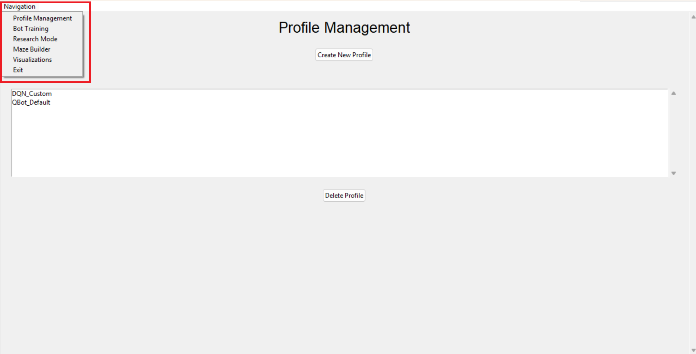

---

## Profile Management

The landing page lists all saved profiles in a scrollable list.

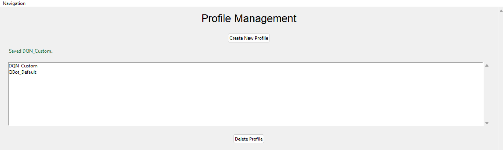

Actions:

- **Create New Profile**: opens the Create/Edit Profile form with blank fields.
- **Double-click a profile**: opens it in the editor pre-filled with its current settings.
- **Single-click a profile**: selects it and enables the **Delete** button.
- **Delete Profile**: requires two clicks. The button first reads *Confirm Delete*; a second click removes the profile and all its saved data permanently.

Status messages appear colour-coded at the bottom of the page (green for success, orange for warning, red for error).

---

## Creating and Editing Profiles

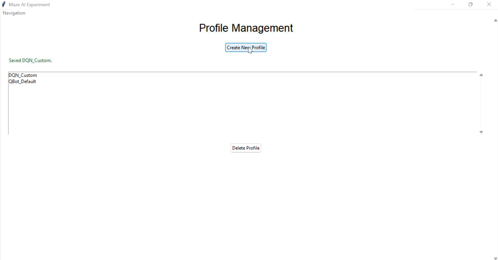

Every profile has:

- **Profile Name**: alphanumeric characters, dashes (`-`), and underscores (`_`) only.
- **Bot Type**: choose between **DQNBot** and **QLearningBot** from the dropdown. Changing the type resets the configuration tabs.

Below those fields, a set of tabs exposes every configuration parameter. Hover over any field to see a tooltip description.

### DQN Bot Configuration

DQN profiles have four tabs.

#### General Tab

| Field | Description |
|---|---|
| `useAttackActions` | Enable attack/push combat actions |
| `autoAttackAdjacentEnemy` | Automatically attack neighbouring enemies without a dedicated action |
| `pushCooldownSteps` | Minimum steps between push attempts |
| `useMacroActions` | Enable macro (multi-step option) actions |
| `macroOptionSet` | Which macro set to use: `1` = naive, `2` = momentum, `3` = A\* (oracle) |
| `useMacroOnlyPolicy` | Disable primitive actions and use only macro options |
| `dualRecordPrimitivePolicy` | Also collect a primitive-action replay buffer alongside the macro one |
| `useHierarchicalPolicy` | Use a two-level hierarchical controller |
| `useLstmPolicy` | Wrap the Q-network in an LSTM for temporal context |
| `lstmSequenceLength` | Number of past steps fed into the LSTM |
| `lstmHiddenSize` | Size of the LSTM hidden state |

#### Core Tab

| Field | Description |
|---|---|
| `learningRate` | SGD/Adam step size |
| `discountFactor` | Future-reward discount $\gamma$ (0-1) |
| `epsilonStart` | Starting exploration rate |
| `epsilonEnd` | Minimum exploration rate after decay |
| `epsilonDecaySteps` | Episodes over which ε decays from start to end |
| `replayCapacity` | Maximum transitions stored in the replay buffer |
| `batchSize` | Transitions sampled per training update |
| `trainFrequency` | Steps between training updates |
| `targetUpdateFrequency` | Steps between target network syncs |
| `hiddenSize` | MLP hidden layer width |
| `maxStepsPerEpisode` | Episode terminates after this many steps |
| `checkpointFrequency` | Save a `.pth` checkpoint every N episodes (0 = disabled) |
| `evaluationFrequency` | Run a zero-epsilon evaluation episode every N episodes (0 = disabled) |
| `diagnosticsFrequency` | How often to write diagnostics data |

#### Encoding Tab

| Field | Description |
|---|---|
| `useRichEncoding` | Add neural map features to the observation |
| `useSharedComparisonState` | Include a shared reference observation for relative encoding |
| `usePositionInState` | Append absolute position to the observation vector |
| `useEntityObservation` | Include entity (enemy) positions in the flat observation |
| `useEnemyObservation` | Include enemy observation channels in the neural map |
| `neuralMapWidth` | Width of the spatial feature map |
| `neuralMapHeight` | Height of the spatial feature map |
| `neuralMapPoolSize` | Pooling reduction factor for the neural map |
| `mapEmbedDim` | Embedding dimension for the spatial features |

#### Rewards Tab (DQN)

See [Reward Configuration](#reward-configuration) below for all reward events. DQN profiles also expose:

| Field | Description |
|---|---|
| `rewardClipMin` | Lower bound for clipping the total reward (must be paired with Max) |
| `rewardClipMax` | Upper bound for clipping the total reward |

---

### Q-Learning Bot Configuration

Q-Learning profiles have two tabs.

#### General Tab

| Field | Description |
|---|---|
| `learningRate` | Q-table step size |
| `discountFactor` | $\gamma$ (0-1) |
| `epsilonStart / End / DecaySteps` | Exploration decay schedule |
| `maxStepsPerEpisode` | Episode step budget |
| `useMacroActions` | Enable macro options |
| `useMacroOnlyPolicy` | Disable primitive actions |
| `useEntityObservation` | Include entities in state |
| `useEnemyObservation` | Include enemies in state |
| `useAttackActions` | Enable attack actions |
| `autoAttackAdjacentEnemy` | Auto-attack adjacent enemies |
| `pushCooldownSteps` | Cooldown between pushes |
| `immediateReversalPenalty` | Penalty for immediately reversing direction |
| `repeatVisitPenaltyScale` | Per-revisit penalty multiplier |
| `noProgressPenalty` | Penalty for stagnating |
| `noProgressPatienceFactor` | Multiplier on optimal path length → allowed stagnation window |
| `minNoProgressSteps / maxNoProgressSteps` | Clamps for the stagnation window |
| `stepLimitStepCoeff / stepLimitAreaCoeff / stepLimitMax / stepLimitMin` | Dynamic step budget parameters |

#### Rewards Tab (Q-Learning)

Same reward events as DQN; see [Reward Configuration](#reward-configuration) below.

---

### Reward Configuration

Every bot type exposes the same set of reward events. Each value can be a number. Penalties should be put in with negatives.
| Event | Default | When it triggers |
|---|---|---|
| `goal_reached` | `1000` | Bot steps onto the goal cell |
| `hit_wall` | `-100` | Bot attempts to move into a wall |
| `revisit_optimal_path` | `-10` | Bot revisits a cell on the known optimal path |
| `revisit_non_optimal_path` | `-15` | Bot revisits a cell off the optimal path |
| `new_tile_visited` | `2` | Bot steps onto a cell for the first time |
| `move_in_optimal_path` | `5` | Bot's step keeps it on the optimal path |
| `see_goal_new_location` | `50` | Bot sees the goal from a new viewpoint |
| `see_goal_revisit` | `5` | Bot sees the goal again from a previously used viewpoint |
| `per_move_penalty` | `-1` | Every step taken |
| `enemy_contact` | `-250` | Enemy occupies the same cell as the bot |
| `death_by_enemy` | `-1000` | Episode ends due to enemy contact |
| `enemy_killed` | `500` | Bot kills an enemy (push into wall or attack) |

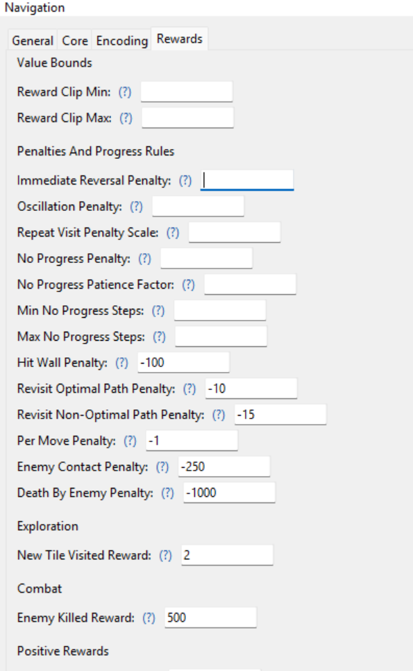

---

## Bot Training

Select **Bot Training** from the Navigation menu.

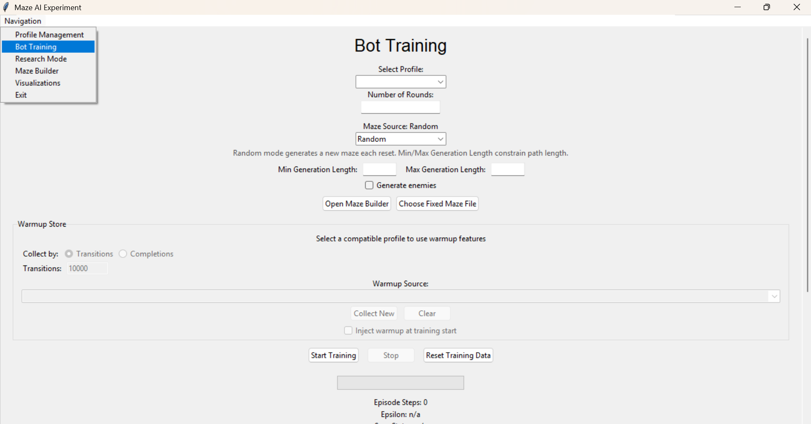

### Maze Source Options

Choose one of three sources for training mazes using the radio buttons:

**Random**: a new maze is generated each episode.

| Field | Description |
|---|---|
| Min Generation Length | Shortest acceptable path length (optional) |
| Max Generation Length | Longest acceptable path length (optional) |
| Generate Enemies | Randomly place enemies in generated mazes |

**Fixed (Builder)**: reuses a single maze loaded from the Maze Builder or from a `.json` file.

- Click **Choose Fixed Maze File** to pick a `.json` maze from disk.
- The selected filename is shown as a label.

**Pool**: generates N random mazes at the start of training and cycles through them.

| Field | Description |
|---|---|
| Pool Size | Number of mazes to generate (default: 20) |

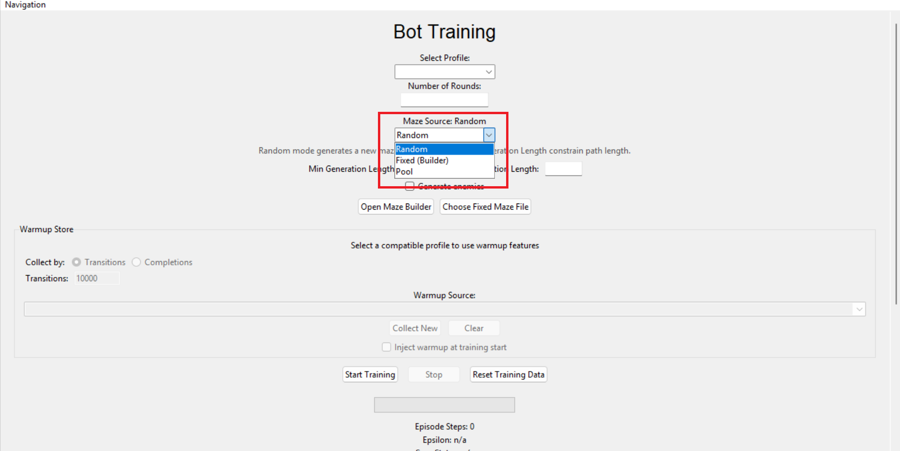

---

### Warmup Store (DQN)

DQN bots benefit from pre-filling the replay buffer before training begins. The **Warmup Store** panel (visible for DQN profiles only) manages this.

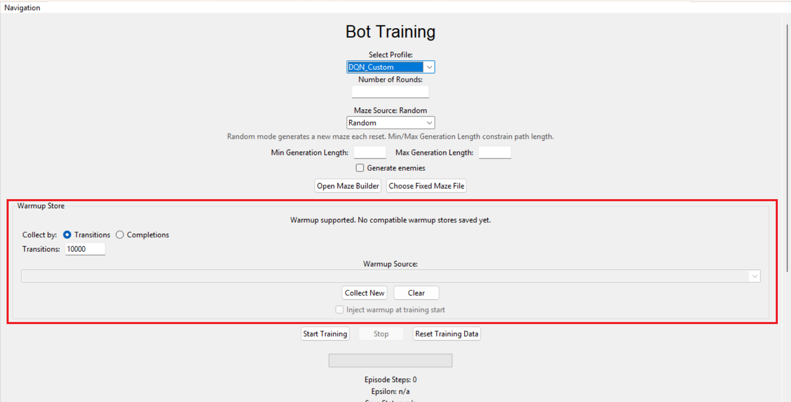

| Control | Description |
|---|---|
| Status label | Shows compatibility and how many transitions are stored |
| Collect By | **Transitions** (fill to N transitions) or **Completions** (run until N maze completions) |
| Transitions / Completions | Target count for the collection run |
| **Collect New** | Starts a background collection run using the current maze source |
| **Clear** | Deletes the warmup store (two-click confirmation) |
| Warmup Source | Dropdown listing available compatible stores |
| Inject Warmup at Training Start | When checked, the selected store is loaded into the replay buffer before episode 1 |

Collection progress is shown inline: *Collecting… 1 200 / 5 000 transitions*.

---

### Training Controls and Status

Before training:

1. Select a profile from the **Select Profile** dropdown.
2. Enter a positive integer in **Number of Rounds**.
3. Configure the maze source.
4. (DQN) Optionally set up a warmup store.
5. Click **Start Training**.

During training:

| Display | Description |
|---|---|
| Progress bar | Fills from 0 to the total number of rounds |
| Episode Steps | Live step count for the current episode, updated every 150 ms |
| Epsilon | Current exploration rate; shows `(manual)` if overridden |
| Save Status | Shows next checkpoint round, or most recent autosave |
| Training log | Round-by-round output (every ~1% of rounds or at boundaries) |

Log output format:

```
Round 42/500  | Goal reached | steps: 87  | wall hits: 3
Round 43/500  | Timed out    | steps: 200 | wall hits: 12
```

Additional log events:

```
Curriculum maze size increased: 10x10 -> 15x15
Warmup entered.
Evaluation after round 100 | epsilon: 0.0500 | goal reached | steps: 63 | reward: 847.00
Training completed.
```

**Stop**: Requests a graceful stop at the end of the current episode.

**Reset Training Data**: clears all learned progress for the selected profile. Two-click confirmation required.

**Epsilon Override (DQN only)**: enter a value in **Manual Epsilon (0-1)** and click **Apply** to override the normal decay schedule. Click **Clear Override** to resume decay.

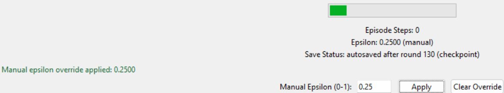

---

### Real-Time Visualization Window

Click **Open Visualization** during training to open a 600 x 600 canvas that renders the current episode live.

Real-time visualization demo: [media/vid/realtime_viz_demo.mp4](media/vid/realtime_viz_demo.mp4)

| Element | Description |
|---|---|
| Walls | Black rectangles |
| Open cells | White-to-red gradient based on visit frequency |
| Optimal path preview | Orange dots (when available) |
| Start cell | Blue |
| Goal cell | Green |
| Bot | Red circle |
| Alive enemies | Orange rectangle labelled `C` (chase) |
| Dead enemies | Grey rectangle |
| Kill flash | Yellow expanding burst at kill location |

Controls inside the window:

| Control | Description |
|---|---|
| Steps per frame | Slider (1-200): controls simulation speed |
| Debug Prints | Enables per-step debug output from the bot |
| Bot View | Restricts display to cells visible from the bot's perspective |
| Pause / Resume | Pauses the simulation loop |

> Note: Training is paused while the visualization window is open. A banner in the training page reminds you of this.

---

## Saved Visualizations

Go to **Visualizations** from the Navigation menu, select a profile, and click **Load Profile**.

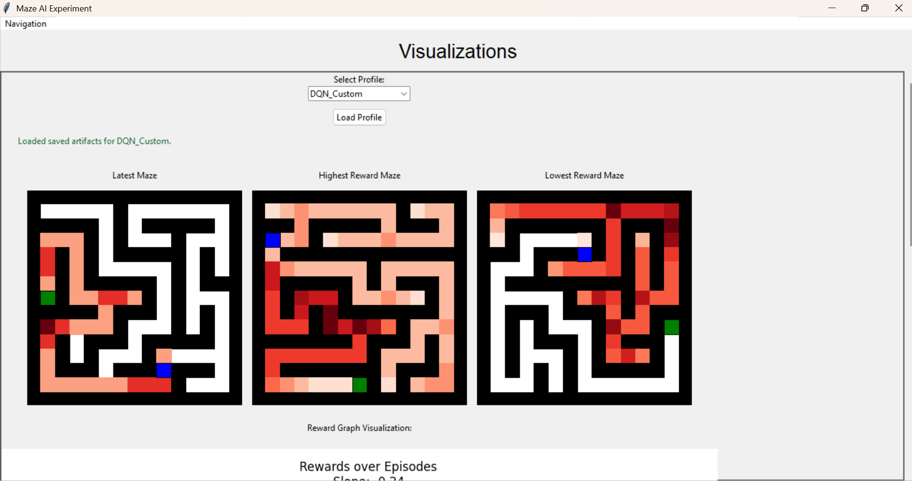

Heatmaps (three side-by-side):

Each heatmap overlays a white-to-red visit-frequency gradient on the maze grid, with the start (blue) and goal (green) marked.

| Heatmap | Source episode |
|---|---|
| Latest Maze | The most recently completed training episode |
| Highest Reward Maze | The episode that achieved the highest total reward |
| Lowest Reward Maze | The episode that achieved the lowest total reward |

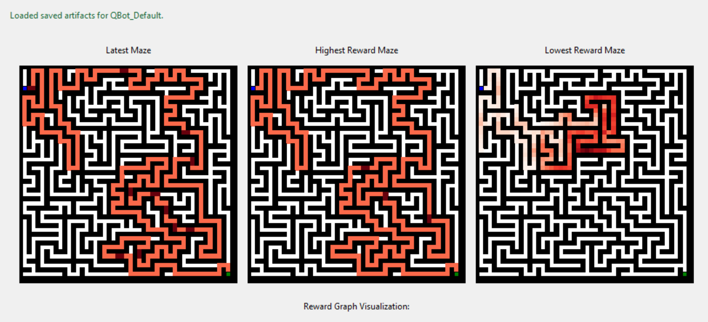

Q-Table / Policy Snapshot (below the heatmaps):

For **Q-Learning** bots: lists the top 10 states by Q-value. Each entry shows the state summary (position, wall layout, goal direction, entities), the best action, and all actions ranked by value.

For **DQN** bots: shows bot metadata (epsilon, replay size, training updates, last loss) and lists all available policy actions with their indices.

Reward Graph:

An embedded Matplotlib chart plotting cumulative reward across training episodes. DQN Bots only save rewards with epsilon at 0.
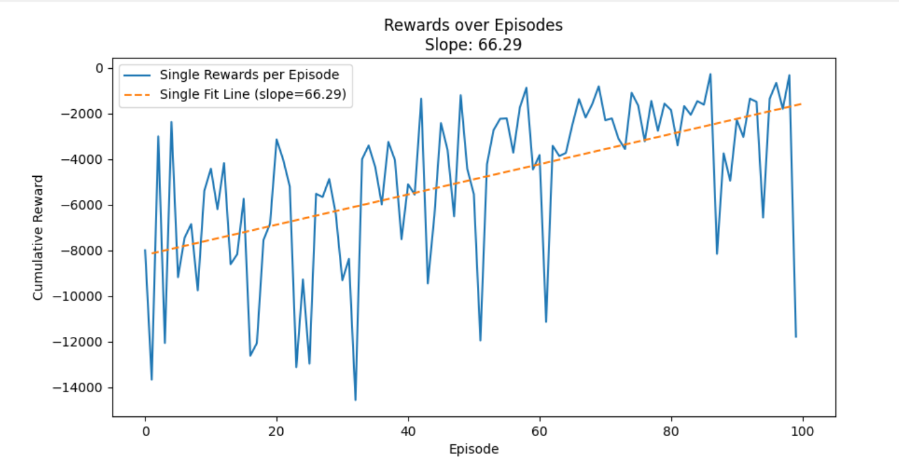

---

## Maze Builder

Select **Maze Builder** from the Navigation menu.

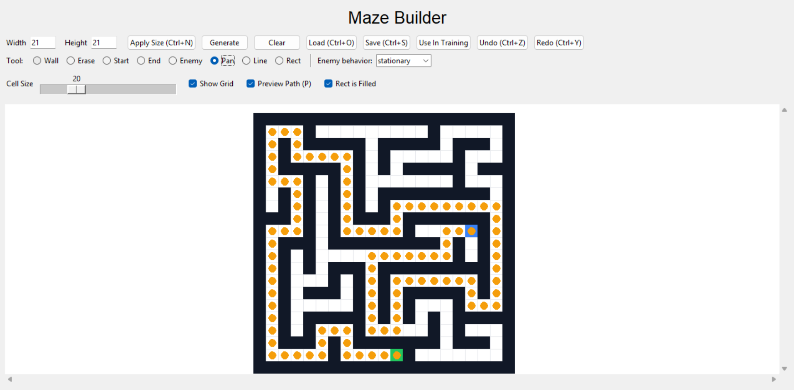

### Dimension Controls

Enter **Width** and **Height** (integers) and click **Apply Size** (or press `Ctrl+N`) to resize. This clears all content.

### Operations

| Button / Shortcut | Action |
|---|---|
| **Generate** | Fills the canvas with a procedurally generated DFS maze |
| **Clear** | Removes all walls (all cells become open) |
| **Load** (`Ctrl+O`) | Opens a file dialog to load a `.json` maze |
| **Save** (`Ctrl+S`) | Opens a file dialog to save the current maze as `.json` |
| **Use In Training** | Sets this maze as the fixed maze for the Training page |
| **Undo** (`Ctrl+Z`) | Reverts the last action (up to 100 levels) |
| **Redo** (`Ctrl+Y`) | Restores an undone action |

### Tools

Select a tool with the radio buttons or press keys **1-8**:

| Key | Tool | Behaviour |
|---|---|---|
| `1` | **Wall** | Paint wall cells |
| `2` | **Erase** | Remove wall cells |
| `3` | **Start** | Place the start position (blue) |
| `4` | **End** | Place the goal position (green) |
| `5` | **Enemy** | Place an enemy; choose *stationary* or *chase* from the dropdown |
| `6` | **Pan** | Click-and-drag to scroll the canvas |
| `7` | **Line** | Drag to draw a straight line of walls |
| `8` | **Rect** | Drag to draw a rectangle; toggle **Rect is Filled** for solid vs. outline |

**Right-click** any cell for a context menu: Toggle Wall, Clear Cell, Set Start, Set End, Place Enemy, Remove Enemy.

**Right-drag** erases regardless of the active tool.

### View Controls

| Control | Description |
|---|---|
| Cell Size slider | 8-60 px per cell |
| Show Grid checkbox | Toggles grid lines |
| Preview Path (`P`) | Shows BFS shortest path as orange dots; requires valid start and end |
| Rect is Filled | Determines whether the Rect tool draws a filled or outline rectangle |

---

## Research Mode

Select **Research Mode** from the Navigation menu.

Research mode runs the supported macro-action quality experiment. You review the fixed plan summary, optionally customise the output folder, then launch. The run trains every agent across every condition and seed defined in the plan, writing all results to disk.

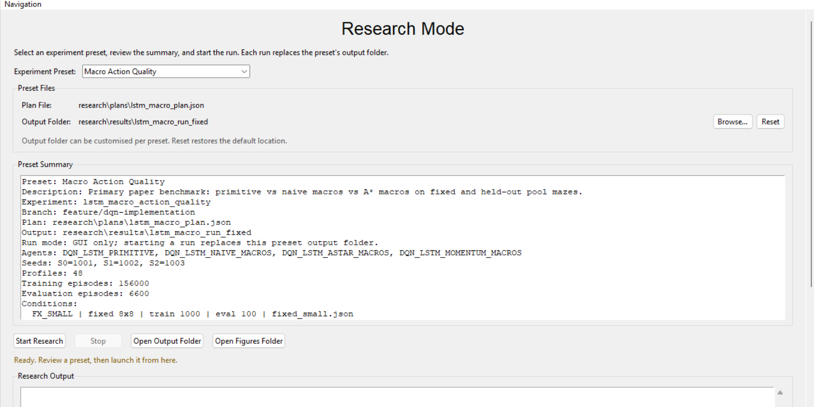

### Setting Up a Run

1. Review the **Summary** text area: it shows the experiment name, description, agent list, conditions, seed count, and episode counts.
2. Optionally click **Browse...** next to *Output Folder* to redirect where results are saved. Click **Reset** to restore the default.
3. Click **Start Research**.

If an output folder already exists you will see a decision dialog:

| Option | Behaviour |
|---|---|
| **Resume Previous** | Skips already-completed profiles and continues from where the run left off |
| **Start Fresh** | Deletes existing output and runs from scratch |
| **Cancel** | Returns to the ready state |

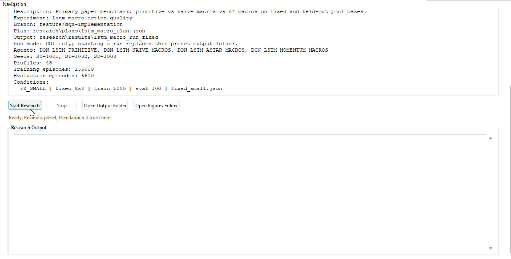

### During a Run

The **Research Output Log** streams all progress in real time:

```
Launching experiment 'Macro Action Quality'
Plan: research/plans/lstm_macro_plan.json
Output: research/results/lstm_macro_run

[Profile 01/48] DQN_LSTM_PRIMITIVE_FX_SMALL_S0
  condition: FX_SMALL fixed 8x8
  training: 1000 episodes
  evaluation: 100 episodes
  status: running
  ...

[Research] Complete
  completed_profiles: 48
  failed_profiles: 0
```

Click **Stop** to gracefully terminate. The process is force-killed if it does not exit within two seconds.

Click **Open Output Folder** or **Open Figures Folder** at any time to browse results.
---

### Research Outputs

After a run completes the output directory contains:

```
research/results/{run_name}/
│
├── manifest.json
├── episodes.csv                           # One row per training episode, all profiles
├── summary_by_profile.csv                 # Per-profile aggregated statistics
├── summary_by_agent_condition.csv         # Aggregated by agent x condition
├── break_even_table_by_seed.csv
├── break_even_table_by_agent_condition.csv
├── final_report_tables.json
│
├── plot_data/
│   ├── reward_curve.csv
│   ├── success_curve.csv
│   └── path_inefficiency_curve.csv
│
└── figures/
    ├── fig1_success.png
    ├── fig2_horizon_wall.png
    ├── fig3_tau.png
    └── fig4_breakeven.png
```

Each profile also gets its own sub-folder containing episode-level rewards, training statistics, and (for DQN) saved checkpoints.

---

### Report Figures

Four publication-quality figures are generated automatically at the end of every research run. They can also be regenerated manually:

```bash
python code/services/research/makeFigures.py research/results/my_run
```

---

**Figure 1 - Evaluation success rate by agent and condition**

Grouped bar chart showing each agent's final evaluation success rate (%) across all test conditions. Higher is better.

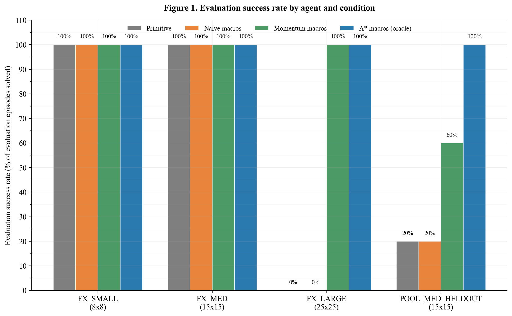

---

**Figure 2 - The decision-horizon wall**

Scatter plot of mean decisions per training episode (log scale, x) against training success rate (y), coloured by agent and shaped by condition. Reveals the point beyond which value cannot propagate back to the start of an episode.

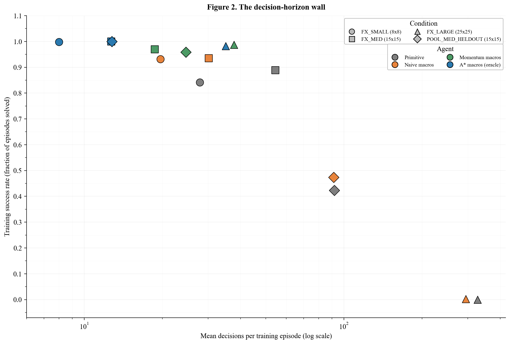

---


**Figure 3 - Realised macro length $\tau$ by condition**

Grouped bar chart showing mean macro length $\tau$ (primitive steps per macro decision) for each macro agent across all conditions. A dotted reference line marks $\tau = 1$ (no compression).

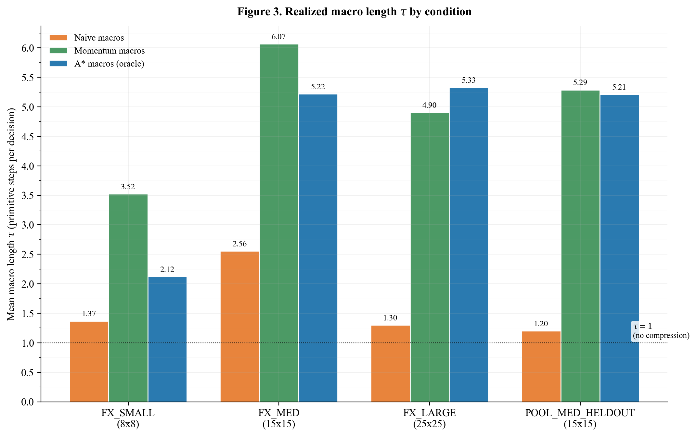

**Figure 4 - Break-even prediction vs. observed outcome**

Each macro agent x condition pair is plotted at its decision compression ratio $C$ (x, log scale) against its break-even threshold $1 + O + R_m$ (y). Points below the diagonal represent cases where macros were predicted to help; circle markers = solved, x markers = failed.

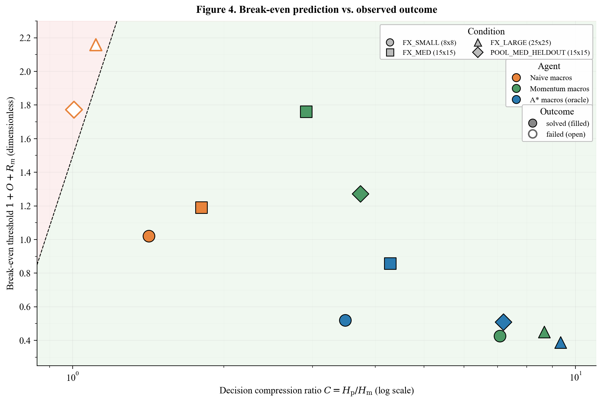

---

## Enemy System

Two enemy types can be placed in mazes (via the Maze Builder or enabled in random generation):

### Stationary

Does not move. Damages the bot if the bot steps onto its cell.

### Chase

Uses BFS pathfinding to pursue the bot. Activates on line-of-sight (same row or column). Once locked on, continues hunting even if line-of-sight is broken.

Combat interactions:

| Event | Outcome |
|---|---|
| Enemy moves onto bot's cell | Bot takes damage; episode may end |
| Bot pushes enemy into a wall | Enemy dies; bot receives `enemy_killed` reward |
| Bot uses attack action on adjacent enemy | Enemy dies; bot receives `enemy_killed` reward |
| Enemy blocks bot's movement attempt | Bot stays in place |

---

## Profile Storage and File Layout

Each profile is stored in its own directory under `profiles/`:

```
profiles/
└── {profile_name}/
    ├── profile.pkl             # Bot type, config, statistics, reward config
    ├── SimulationRewards.txt   # Per-episode reward log (auto-updated during training)
    ├── HeatmapData.txt         # Visit-frequency map for the latest/best/worst episodes
    ├── mazes.json              # Cached maze snapshots (latest, best, worst)
    └── checkpoints/            # DQN only
        ├── episode_100.pth
        ├── episode_200.pth
        └── ...
```

Profile data is written atomically (temp file + rename) and protected by per-path locks so training threads cannot corrupt a save in progress.

Deleting a profile from the UI removes the entire directory including all checkpoints and logs.

---
